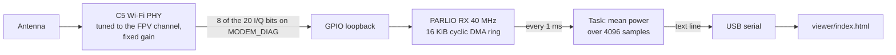

# C5 RSSI

Firmware that turns a Waveshare ESP32-C5-Zero into a 1 kHz signal-strength meter for one analog 5.8 GHz FPV channel, as a cheaper stand-in for an RX5808 in a lap timer. It reuses the C5VRX trick of streaming the Wi-Fi PHY's raw I/Q samples out through GPIO, but only measures power: there is no demodulator, DAC, or video output. The board needs nothing but USB; it has an on-board antenna and a U.FL connector.

A WebSerial page in [viewer/](viewer/index.html) graphs the readings and changes channel, gain, and bandwidth.

This branch is an experiment. The docs in [docs/](docs/) describe the original C5VRX video receiver, not this firmware.

## How it works



- [main/rf.c](main/rf.c) starts Wi-Fi receive-only, disables the vendor AGC, forces continuous sampling, and routes I/Q to GPIO. It tunes any frequency from 5180 to 5950 MHz by landing on the nearest Wi-Fi channel and then calling the undocumented `phy_set_freq()`.
- [main/main.c](main/main.c) captures the I/Q into a DMA ring that refills itself with no CPU involvement. Once per millisecond it averages signal power over every 4th byte of the ring (about 410 µs of signal) and prints the result.

## Pins

Nothing is wired to the I/Q pins: each one loops its own output back to its own input, so they sit on the back pads and the left edge. That keeps the lower right edge free, including a gap at GP7, for an RX5808 module to compare against.

| Function | Pins |
|---|---|
| I/Q capture (bits 0-7 of each byte) | GP1, GP0, GP25, GP23, GP24, GP5, GP3, GP4 |
| Antenna switch: low on-board, high U.FL | GP26 |
| RX5808 reference module: RSSI, DATA, LE, CLK | GP6, GP8, GP9, GP10 |
| Free | GP2, GP7, GP11, GP12 |

## Capture layouts

The ADC produces 10-bit I and Q, and MODEM_DIAG exposes them on 20 lines. PARLIO RX on the C5 captures at most 8 lines, so the firmware picks 8 of them, switchable at runtime:

| Layout | Command | Byte contents | Power |
|---|---|---|---|
| I 8-bit | `m2` | I[9:2] | 2 × I² |
| Q 8-bit | `m1` | Q[9:2] | 2 × Q² |
| I+Q 4-bit | `m0` | I[9:6] in the high nibble, Q[9:6] in the low nibble | I² + Q² |

I 8-bit is the default. The 4-bit layout reads a false floor around 23 dB, because taking the top 4 bits rounds every small negative sample away from zero, so it cannot see weak signals at all. The other layouts remain for the bit check below.

The 8-bit layouts give up one component. Video keeps an FM carrier rotating, so over 410 µs each component carries half the power, and doubling Q² recovers the total. Each extra bit adds about 6 dB between the noise floor and clipping, so 8-bit covers about 45 dB against about 20 dB for 4-bit.

Only DIAG 6-9 (Q[9:6]) and 16-19 (I[9:6]) are verified on hardware. The 8-bit layouts assume DIAG n carries Q[n] and DIAG 10+n carries I[n]. To check, select Q 8-bit with a VTX nearby, click "Capture raw samples", and read:

- The bit table: bits that sit at 0% or 100% ones are stuck, and bits that toggle close to 100% of the time are clocks. Real low bits sit near 50% ones and toggle around 50%.
- The histogram: real bits give a smooth shape. Unrelated low bits give flat steps between the lines every 16 values, and stuck ones give isolated spikes. The summary sentence reports the step size as a ratio, where near 1 is smooth.
- The waveform: the 8-bit trace should follow the 4-bit staircase closely and fill in between its steps.

## Build

Docker is the only requirement. From the repository root:

```bash
docker run --rm -v "${PWD}:/workspace" -w /workspace espressif/idf:v6.1 idf.py build
```

## Flash

Docker on macOS can't reach USB devices, so flash from the host with esptool:

```bash
python3 -m pip install --user esptool
```

```bash
cd build && python3 -m esptool --chip esp32c5 write-flash @flash_args
```

If esptool can't connect, hold B (boot) while tapping R (reset) to enter download mode, flash, then tap RESET.

## View

Open the viewer in Chrome or Edge (WebSerial is not in Firefox or Safari). Opening `viewer/index.html` directly works, or serve it:

```bash
python3 -m http.server 8765 --directory viewer
```

Then open http://localhost:8765 and click Connect. Add `?demo` to the URL to see synthetic data without a board.

The graph shows the mean in each pixel column as a line, the min/max range as a band, the peak as a dashed line, and clipping as red ticks along the bottom. A green line traces the 100 ms peaks, and detected passes are shaded.

Pass detection follows RotorHazard's node firmware: a 255-sample median at 1 kHz, dated to the middle of its window so a filtered peak still lands at the moment the drone passed. A median beats an average here because multipath fades are brief downward spikes it ignores, and it beats a peak because a peak latches onto whichever single millisecond was luckiest.

A pass starts when that median rises a set number of dB above the baseline, the 20th percentile of the last 30 s, and ends when it falls back. Both thresholds are relative to the baseline, so they follow the room instead of needing absolute levels. The pass time is the middle of the peak, which avoids bias when the peak is flat. The board's own 100 ms peaks stay on the chart as a fainter line.

## Running it as a RotorHazard node

The surest way to know whether any of this works is to let RotorHazard judge it. The board can present itself as two timing nodes on one USB connection: node 1 is the C5's own receiver, node 2 is the RX5808. Both watch the same passes, so its race log compares them directly.

It speaks RotorHazard's node API level 36. The switch is automatic: the first command byte from a server puts the board into node mode, where the text protocol and the viewer go quiet until the board is reset.

Setup:

1. Connect the board by USB to the machine running RotorHazard.
2. Add the port to `SERIAL_PORTS` in its `config.json`, for example `"SERIAL_PORTS": ["/dev/ttyACM0"]`, and restart the server. It should find two nodes.
3. Set both nodes to the channel your VTX uses. Each node tunes its own receiver.
4. Calibrate enter and exit levels per node, since the two report on different scales.

The scales are:

- Node 1, the C5: 4 counts per dB, so its 0-255 covers about 64 dB.
- Node 2, the RX5808: 2.5 V of its RSSI pin mapped to 0-255, the same as RotorHazard's own node firmware.

Laps, crossings, peaks and RotorHazard's per-node RSSI graphs all work. The graphs come from extremum history: the node queues the filtered signal's turning points, peaks and nadirs with when they started and how long they held, and the server stitches them back into a trace. Unlike upstream, a turning point is only declared on a real change of direction, so a staircase ramp gives one peak rather than one per step.

[test/run.sh](test/run.sh) exercises the protocol and lap detection on the host, with no board attached: it checks framing and checksums, multi-node addressing, per-node tuning, that each simulated pass yields exactly one lap timed at the peak rather than 128 ms late, and that two passes come back as history of exactly peak, nadir, peak, oldest first.

## Serial protocol

Each line from the board is one record:

- `S <t_us> <pwr_x100> <clip> <rx5808_mv>` is one reading. `pwr_x100` is 100 × the mean power over 4096 samples in units of 8-bit LSB², so dB = 10·log10(pwr_x100 / 100). `clip` counts samples at the layout's limit. `rx5808_mv` is the reference module's RSSI pin, or near 0 with no module fitted.
- `I <freq_mhz> <gain> <bw40> <external_antenna> <layout> <retune_us>` is the current settings, sent once a second and after every command. `retune_us` is how long the last frequency change took.
- `P <t_us> <window_ms> <peak_x100> <mean_x100> <rx_peak_mv> <rx_mean_mv>` summarizes each 100 ms window. Multipath fading swings single readings by 20 dB while the drone barely moves, so the window peak tracks the envelope far better than any average.
- `D <layout> <chunk> <chunks> <hex>` carries part of a raw capture: 1024 consecutive bytes split over 8 lines.
- `E <command>: <error>` reports a rejected command.
- Anything else is ESP-IDF log output.

The board sends nothing until it receives its first text command; the viewer sends `s` on connect, repeating until it hears back. Opening the port resets the board, and a RotorHazard server probes within microseconds of flushing its input, so text already streaming would bury its first replies.

A RotorHazard server's first command byte switches the board to [node mode](#running-it-as-a-rotorhazard-node) until it is reset; none of the text commands collide with its command codes.

Commands to the board are one line each:

- `f<mhz>` tunes, for example `f5917` for R8.
- `g<n>` sets the fixed receive gain, 0 to 62. Higher is more sensitive. It starts at 36, which avoids clipping at close range in a room.
- `b0` or `b1` selects the BW20 (±10 MHz) or BW40 (±20 MHz) analog filter. BW20 rejects neighboring channels better.
- `a0` or `a1` selects the on-board antenna or the U.FL connector (GPIO26). It starts on the on-board antenna.
- `m0`, `m1` or `m2` selects the capture layout. It starts at `m2`, 8-bit I.
- `d` sends a raw capture as `D` lines.
- `s` requests an `I` line.

## RX5808 comparison

An RX5808 module wired to GP6, GP8, GP9 and GP10 gives a known-good reference. `f` tunes both receivers together, and every reading carries the module's RSSI voltage alongside ours.

The module's RSSI pin is a log detector, so its voltage should be a straight line against our dB. The viewer fits that line continuously and reports it as `mV = a + b x dB` with an r². An r² near 1 means the two receivers agree; the slope is millivolts per dB. The fit does two things:

- It quotes our readings in the module's millivolts, for dropping into code that expects RX5808 numbers.
- It rescales the module's trace onto our dB axis. Both receivers get the same 255 ms median, so the two lines on the chart differ only where the receivers themselves disagree.

Expect the fit to drift. The module's RSSI comes from a log detector behind an IF strip with its own gain control, so it compresses at strong signal and wanders with temperature. RotorHazard handles this by recalibrating per node; here the pass thresholds are relative to a rolling baseline, which absorbs the same drift.

Wiring notes: power the module from the 5V pin with a shared ground, since its SPI inputs are 3.3 V logic either way. Keep the analog RSSI wire short. The firmware averages 4 ADC reads per millisecond in place of an RC filter on that line; a capacitor of 10 nF or more to ground, with about 1 kΩ in series, helps further but is not needed. Most modules need their SPI mod done before the tuning lines do anything.

## What to test first

1. R8 tunes at all. Tune `f5917` with a VTX on R8 and confirm the reading rises when you bring it close. 5917 MHz is above every Wi-Fi channel, so this is untested.
2. A walk-past gives a clean peak. Try a few gains: too high and the noise floor sits near the top with clipping on every pass, too low and passes at a distance disappear.
3. A neighbor on the adjacent Raceband channel doesn't raise the reading much, in BW40 and BW20.
4. The viewer reports close to 1000 samples/s.

## Limits

- Readings are relative dB, not dBm.
- Retune time is unmeasured; the viewer shows it as "Last retune". Readings taken during a retune are meaningless.
- Everything below Wi-Fi driver level uses undocumented Espressif functions and register addresses tied to the ESP-IDF version. They were first found on 6.0 and link unchanged on 6.1, but behavior on 6.1 is untested.
