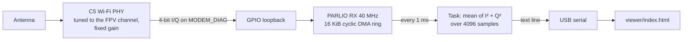

# C5 RSSI

Firmware that turns a Waveshare ESP32-C5-Zero into a 1 kHz signal-strength meter for one analog 5.8 GHz FPV channel, as a cheaper stand-in for an RX5808 in a lap timer. It reuses the C5VRX trick of streaming the Wi-Fi PHY's raw I/Q samples out through GPIO, but only measures power: there is no demodulator, DAC, or video output. The board needs nothing but USB; it has an on-board antenna and a U.FL connector.

A WebSerial page in [viewer/](viewer/index.html) graphs the readings and changes channel, gain, and bandwidth.

This branch is an experiment. The docs in [docs/](docs/) describe the original C5VRX video receiver, not this firmware.

## How it works



- [main/rf.c](main/rf.c) starts Wi-Fi receive-only, disables the vendor AGC, forces continuous sampling, and routes I/Q to GPIO. It tunes any frequency from 5180 to 5950 MHz by landing on the nearest Wi-Fi channel and then calling the undocumented `phy_set_freq()`.
- [main/main.c](main/main.c) captures the I/Q into a DMA ring that refills itself with no CPU involvement. Once per millisecond it averages I² + Q² over every 4th byte of the ring (about 410 µs of signal) and prints the result.

## Build

Docker is the only requirement. From the repository root:

```bash
docker run --rm -v "${PWD}:/workspace" -w /workspace espressif/idf:v6.0.2 idf.py build
```

## Flash

Docker on macOS can't reach USB devices, so flash from the host with esptool:

```bash
python3 -m pip install --user esptool
```

```bash
cd build && python3 -m esptool --chip esp32c5 write-flash @flash_args
```

If esptool can't connect, hold B (boot) while tapping R (reset) to enter download mode, flash, then tap RESET.

## View

Open the viewer in Chrome or Edge (WebSerial is not in Firefox or Safari). Opening `viewer/index.html` directly works, or serve it:

```bash
python3 -m http.server 8765 --directory viewer
```

Then open http://localhost:8765 and click Connect. Add `?demo` to the URL to see synthetic data without a board.

The graph shows the mean in each pixel column as a line, the min/max range as a band, the peak as a dashed line, and clipping as red ticks along the bottom.

## Serial protocol

Each line from the board is one record:

- `S <t_us> <pwr_x100> <clip>` is one reading. `pwr_x100` is 100 × mean(I² + Q²) over 4096 samples, so dB = 10·log10(pwr_x100 / 100). `clip` counts samples where I or Q hit the 4-bit limit.
- `I <freq_mhz> <gain> <bw40> <external_antenna> <retune_us>` is the current settings, sent once a second and after every command. `retune_us` is how long the last frequency change took.
- `E <command>: <error>` reports a rejected command.
- Anything else is ESP-IDF log output.

Commands to the board are one line each:

- `f<mhz>` tunes, for example `f5917` for R8.
- `g<n>` sets the fixed receive gain, 0 to 62. Higher is more sensitive. It starts at 40.
- `b0` or `b1` selects the BW20 (±10 MHz) or BW40 (±20 MHz) analog filter. BW20 rejects neighboring channels better.
- `a0` or `a1` selects the on-board antenna or the U.FL connector (GPIO26). It starts on the on-board antenna.
- `?` requests an `I` line.

## What to test first

1. R8 tunes at all. Tune `f5917` with a VTX on R8 and confirm the reading rises when you bring it close. 5917 MHz is above every Wi-Fi channel, so this is untested.
2. A walk-past gives a clean peak. Try a few gains: too high and the noise floor sits near the top with clipping on every pass, too low and passes at a distance disappear.
3. A neighbor on the adjacent Raceband channel doesn't raise the reading much, in BW40 and BW20.
4. The viewer reports close to 1000 samples/s.

## Limits

- Readings are relative dB, not dBm. At a fixed gain the 4-bit samples cover roughly 20 to 25 dB between the noise floor and clipping. That is enough to spot a close pass but not to measure distance.
- Retune time is unmeasured; the viewer shows it as "Last retune". Readings taken during a retune are meaningless.
- Everything below Wi-Fi driver level uses undocumented Espressif functions and register addresses tied to ESP-IDF 6.0.
