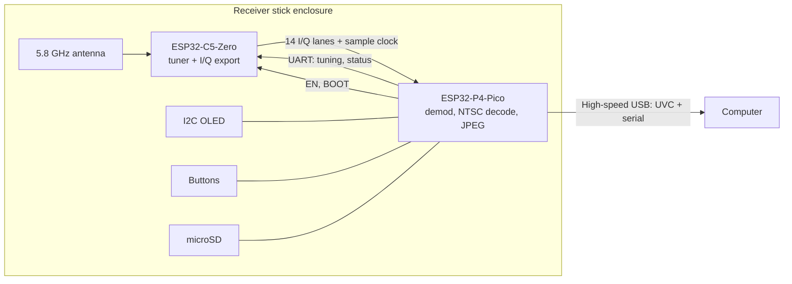
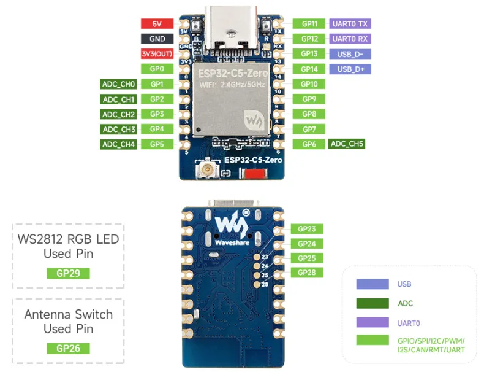
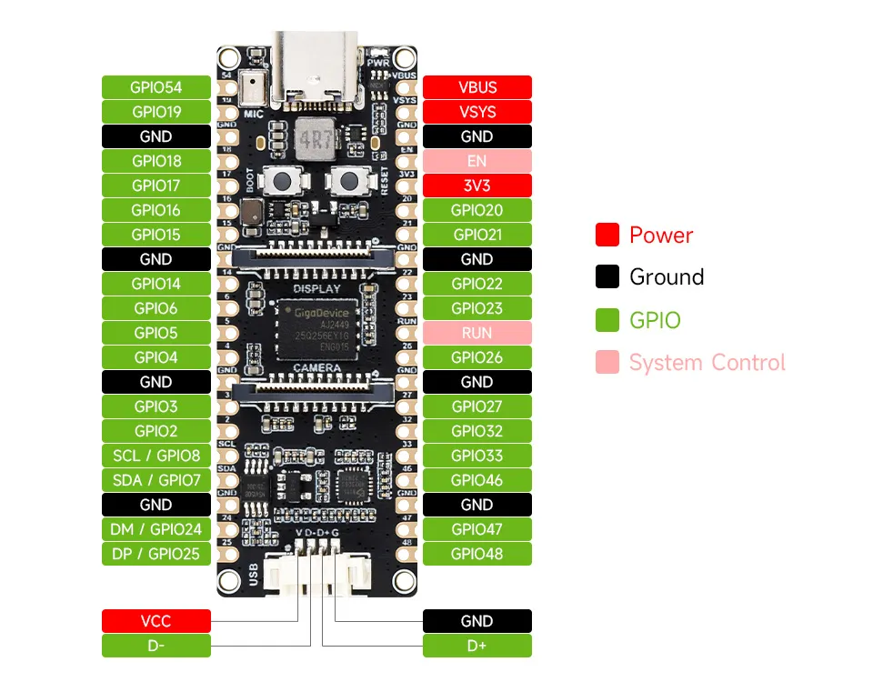

# P4 receiver plan

Plan for a self-contained receiver built from the Waveshare ESP32-C5-Zero and the Waveshare ESP32-P4-Pico. The C5 tunes and exports raw I/Q, and the P4 demodulates, decodes NTSC, and presents the video as a USB webcam (UVC) with a serial control port on the same cable.

This is a separate build from the standalone C5 receiver. The C5-only path, which recovers composite video onto the resistor DAC and never decodes pixels, stays as it is.

Status: the receiver works end to end. The C5 tunes and exports live I/Q, and the P4 demodulates it and decodes NTSC in color into the camera at 59.9 fields per second, with the console on the same cable. The OLED, buttons and microSD recording are not built yet.

Where to look:

- [Bring-up](#bring-up) has the console commands, the Rake tasks and what has been verified on the hardware.
- [Firmware](#firmware) describes how the C5 and P4 firmware work.
- [Open questions](#open-questions) lists what is still undecided.
- [P4 receiver findings](p4-receiver-findings.md) collects what the hardware has shown so far.

## System overview



## Roles

- The C5 tunes the 5.8 GHz front end and drives its MODEM_DIAG I/Q bits onto pads, with a sample clock. It answers tuning and status commands on a UART. Its DAC and PARLIO loopback are not used in this build.
- The P4 samples the I/Q bus with PARLIO RX, demodulates FM, decodes NTSC fields, encodes JPEG, and serves UVC. It owns all settings (band, channel) and pushes them to the C5 at boot. It runs the OLED, buttons, and optional SD recording (see [Controls and display](#controls-and-display)).
- The computer receives a webcam stream and a serial port. A browser page (Web Serial) controls the receiver and shows signal strength.

## Power

- The P4-Pico is powered through its high-speed USB connector (the bottom 4-pin MX1.25 JST), which feeds its VCC_5V rail directly. The top USB-C also powers it, through an ideal-diode FET (AO3401 driven by an MMDT3906 pair), so both can be plugged in at once. That FET stops the JST from back-feeding the USB-C, but JST pin 1 is tied straight to VCC_5V, so a USB-C supply that sits higher pushes current back into the JST host. Plug both into the same computer, not the USB-C into a charger.
- The C5 takes 5V from the P4's VSYS pin (right header, row 2), which is the same VCC_5V net as JST pin 1. VSYS is at the far end of the P4, so this is one 7.5 cm wire, routed under the P4 alongside the USB lead. Neither board has a 5V pad near the JST, and splicing into the crimped JST lead is fragile. Do not use VBUS, which is the USB-C input before the power-path FET.
- The C5's ground return is the clock-return wire from the P4's left row-18 GND to the C5's GND pad, plus a wire from a USB-C shell tab on the I side. At about 150 mA, 30 AWG over 3 cm drops under 2 mV, so no separate power ground is needed.
- Do not power the C5 from its own USB while it is also fed from VSYS, unless the C5-Zero schematic shows a diode on its VBUS.
- Budget: roughly 100-150 mA for the C5, 200-400 mA for the P4, and about 20 mA for the OLED. This fits the 500 mA of a USB 2.0 port.

## Board pinouts

Waveshare's diagrams, from the [ESP32-C5-Zero](https://docs.waveshare.com/ESP32-C5-Zero) and [ESP32-P4-Pico](https://docs.waveshare.com/ESP32-P4-Pico) wiki pages:

- [C5-Zero pinout](images/waveshare-c5-zero-pinout.webp) and [dimensions](images/waveshare-c5-zero-size.webp) (18 × 28 mm).
- [P4-Pico pinout](images/waveshare-p4-pico-pinout.webp), [dimensions](images/waveshare-p4-pico-size.webp) (57.3 × 21 mm) and [front and back](images/waveshare-p4-pico-hardware.webp), which shows the back pads.





Physical order, both boards viewed from the component side with the USB-C at the top:

- C5-Zero left edge: 5V, GND, 3V3, 0, 1, 2, 3, 4, 5. Right edge: 11, 12, 13, 14, 10, 9, 8, 7, 6. Back pads 23, 24, 25 and 28 sit in a column about 1.6 mm apart, inboard of the left edge, level with rows 4-6. The U.FL and antenna are at the bottom.
- P4-Pico left header (rows 1-20): 54, 19, GND, 18, 17, 16, 15, GND, 14, 6, 5, 4, GND, 3, 2, 8, 7, GND, 24, 25. Right header: VBUS, VSYS, GND, EN, 3V3, 20, 21, GND, 22, 23, RUN, 26, GND, 27, 32, 33, 46, GND, 47, 48. The JST is at the bottom, below row 20. The silkscreen labels GPIO 8 as SCL (row 16) and GPIO 7 as SDA (row 17), and GPIO 24/25 appear as DM/DP on Waveshare's pinout.
- P4-Pico back pads, seen from the front: 28, 29, 30, 31, 34 run down the right side and 36, 49, 50, 51, 52 down the left, about 1.6 mm apart, in the last 8 mm before the JST end. 34 and 36 are strapping pins.

## Layout

Both boards sit face-up in line: antenna at the front, then the C5 with its USB-C end facing back, then the P4 with its JST end facing the C5, and the P4's USB-C at the rear. The gap between the boards is about 8 mm, enough for the JST plug and its lead to turn back under the P4.

Both USB-C ends point the same way, so the C5's left edge (5V, GND, 0-5 and its back pads) lines up with the P4's left header and back pads 49-52, and its right edge (11-14, 6-10) lines up with the P4's right header and back pads 28-31. Every wire stays on its own side, back-pad wires on both boards run underneath together, and the fast signals use the P4 pins within about 20 mm of the JST end.

## C5-Zero pin plan

Each data wire carries one fixed bit, so the build can be handed to someone else as a pin-to-pin list. Q7 and I7 are the most significant bits. The C5 and P4 could route any lane to any pad in firmware, but a fixed assignment makes a miswired build visible instead of silently remapped. A walking-ones self-test at boot names any wire that doesn't land where the plan says (see [Firmware](#firmware)).

| Function | C5 pins | Notes |
|---|---|---|
| 5V, GND | 5V, GND (left, rows 1-2) | 5V from the P4's VSYS; GND is the clock-return wire |
| UART to P4 | 11 (TX), 12 (RX) | UART0, so the ROM bootloader can be reached and the P4 can reflash the C5 (confirmed: the ROM banner and esptool both reach it). TX has a 499 Ω series resistor on the board |
| BOOT | 28 (back pad) | Driven by the P4, open-drain. The board's BOOT button is unreliable, so this is also the manual fallback: ground 28 while resetting |
| Reset | EN, via the RESET button pad | Driven by the P4, open-drain. EN (CHIP_PU) is not on the edge pads; it has a 10k pull-up and 1 µF to GND, so reset release is slow |
| Sample clock out | 0 | Two rows from the GND pad |
| Q data (7 lanes) | Q7 on 1, Q6 on 2, Q5 on 3, Q4 on 4, Q3 on 23, Q2 on 24, Q1 on 25 | Left side. The top 7 of Q's 8 live bits |
| I data (7 lanes) | I7 on 6, I6 on 7, I5 on 8, I4 on 9, I3 on 10, I2 on 13, I1 on 14 | Right side. The top 7 of I's 8 live bits |
| Spare | 5 | Farthest pad from the P4 |
| Antenna select | 26 | Internal to the board |

From the [C5-Zero schematic](https://github.com/waveshareteam/ESP32-C5-Zero/tree/main/hardware/schematics): GPIO 0 and 1 are the C5's 32 kHz crystal pins, but no crystal is fitted, so they are plain GPIOs. GPIO 13 and 14 pass through 22 Ω series resistors and also reach the USB-C connector, a short stub that shouldn't matter at 40 MHz. The back pads 23, 24, 25 and 28 are test points rather than through-holes, so tack the wires on and anchor them. GPIO 28 has a 10k pull-up to 3.3 V.

GPIO 2, 7 and 25 are strapping pins. They are safe as data outputs because the P4 inputs are high-impedance while the C5 reads its straps at reset.

GPIO 13 and 14 are the C5's USB pins. The finished build gives up the C5's USB console and uses them as data pads, so firmware must release them from the USB PHY before driving them. Standalone flashing over the C5's USB still works with BOOT held, because the ROM re-enables USB serial in download mode. Don't plug the C5's USB into anything while it is streaming.

All 8 bits of both I and Q are live (confirmed on another branch), but 8+8 needs 17 pads: 16 lanes plus the clock. That only fits if the C5's USB becomes the control and flashing link to a USB host on the P4, freeing the UART and BOOT pads. 7+7 keeps the simpler UART control and passthrough flashing.

## P4-Pico pin plan

| Function | P4 pins | Notes |
|---|---|---|
| Q data (7) | Q7 on 25, Q6 on 50, Q5 on 51, Q4 on 52, Q3 on 3, Q2 on 2, Q1 on 49 | Left side. 49-52 are back pads |
| Sample clock | 24 | Next to the left row-18 GND. 24/25 are the full-speed USB pair, so firmware must release them from the USB PHY, which gives up the P4's USB-Serial-JTAG. Flashing and the console use the high-speed port or the CH343 instead, and JTAG debugging over these pins isn't available |
| C5 BOOT | 8 (labeled SCL) | Open-drain. 8 is the codec's I2C SCL with a 2.2k pull-up, which only strengthens BOOT's pull-up; the codec is unused |
| I data (7) | I7 on 30, I6 on 29, I5 on 48, I4 on 28, I3 on 47, I2 on 33, I1 on 46 | Right side. 28-30 are back pads |
| UART RX from C5 TX (GPIO11) | 32 | |
| UART TX to C5 RX (GPIO12) | 27 | |
| C5 EN | 26 | Open-drain |
| OLED I2C: SDA, SCL | 15, 16 | 0.91" 128×32 SSD1306 modules are I2C only |
| Buttons: BAND, CH−, CH+ | 5, 6, 7 (labeled SDA) | Active-low to GND. 7 is the codec's I2C SDA with a 2.2k pull-up, which suits an active-low button |
| Spare | 4, 14, 17, 18, 19, 20, 21, 22, 23, 54, and back pad 31 | 14 is kept for a fourth button |

Board facts from the [P4-Pico schematic](https://files.waveshare.com/wiki/ESP32-P4-Pico/ESP32-P4-Pico-datasheet.pdf):

- The top USB-C goes only to a CH343 USB-UART (P4 UART0 on GPIO 37/38, with auto-reset). It carries the boot and panic log and is a fallback for flashing and the console, not UVC. In this layout it is at the rear, reachable through the enclosure.
- High-speed USB goes only to the bottom MX1.25 connector (V, D-, D+, G).
- The header pin labeled EN is the 3.3 V regulator enable, and RUN resets the P4. Neither is used here.
- The audio codec (I2S on GPIO 9-13), speaker amp (GPIO 53), SD card (GPIO 39-45) and flash are on pins not used by this plan.
- GPIO 34 and 36 are strapping pins; leave them alone.
- This board's P4 is chip revision v1.3. ESP-IDF 6.x targets v3 by default, so `p4usb` sets `CONFIG_ESP32P4_SELECTS_REV_LESS_V3`.
- GPIO 26 and 27 are also the full-speed OTG PHY pads, as 24 and 25 are the USB-Serial-JTAG's; selecting them as GPIOs detaches the PHY.

## Physical build

### Stick layout

- Keep the last 2-3 cm around the antenna free of wires, screws and metal.
- The P4's switching regulator sits at its USB-C end, which is the rear, away from the antenna.
- If the external dipole is used, mount an SMA bulkhead at the tip with a short U.FL pigtail.
- The OLED and buttons sit in a row along the stick, screen first: `[OLED] o o o`. See [Controls and display](#controls-and-display).
- Hold the boards with printed standoffs and clips or double-sided tape, and anchor the wire bundles so flexing doesn't land on solder joints.

### Wire list

Lengths are estimates for the 8 mm gap, including about 6 mm of slack for dressing and strain relief. Cut each to fit; every signal wire is 4.5 cm or less. Wires to the back pads run underneath both boards. The C5's castellated edge pads and the P4's header holes take a wire from either face, so a wire can run from a back pad on one board to an edge pad on the other.

Colors: red is 5V, black is GND, white is the clock, green is Q data, blue is I data, and yellow is control. Wires within a color look alike, so solder each one pin-to-pin from the list and check it off; the boot self-test catches mistakes. The four yellow wires are distinguishable by position: BOOT is the only yellow on the Q side, and on the I side, EN goes to the RESET button pad while TX and RX go to adjacent header pads. The P4 can swap its UART pins in firmware if TX and RX are crossed.

| Signal | C5 pin | P4 pin | Color | Length |
|---|---|---|---|---|
| Clock | 0 | 24 | White | 3 cm |
| GND (clock return and power) | GND | GND, left row 18 | Black | 3 cm |
| Q7 | 1 | 25 | Green | 3 cm |
| Q6 | 2 | 50 (back) | Green | 3 cm |
| Q5 | 3 | 51 (back) | Green | 3.5 cm |
| Q4 | 4 | 52 (back) | Green | 3.5 cm |
| Q3 | 23 (back) | 3 | Green | 4.5 cm |
| Q2 | 24 (back) | 2 | Green | 4 cm |
| Q1 | 25 (back) | 49 (back) | Green | 3 cm |
| BOOT | 28 (back) | 8 (SCL) | Yellow | 4.5 cm |
| I7 | 6 | 30 (back) | Blue | 4 cm |
| I6 | 7 | 29 (back) | Blue | 4 cm |
| I5 | 8 | 48 | Blue | 3.5 cm |
| I4 | 9 | 28 (back) | Blue | 3.5 cm |
| I3 | 10 | 47 | Blue | 3.5 cm |
| I2 | 13 | 33 | Blue | 3.5 cm |
| I1 | 14 | 46 | Blue | 3.5 cm |
| UART C5 TX to P4 RX | 11 | 32 | Yellow | 3.5 cm |
| UART C5 RX from P4 TX | 12 | 27 | Yellow | 4 cm |
| EN | RESET button pad | 26 | Yellow | 4 cm |
| GND (I-side return) | USB-C shell tab (back, I side, front tab) | GND, right row 18 | Black | 3 cm |
| 5V | 5V | VSYS, right row 2 | Red | 7.5 cm |

### Wiring practice

- Use 30 AWG (Kynar wire-wrap wire works well) for signals. At these lengths the wires behave as plain wires, and length matching doesn't matter (2 cm is about 0.1 ns against a 25 ns sample period).
- Use 28 AWG, or two 30 AWG in parallel, for the 5V wire.
- The C5-Zero has one GND pad. Its second ground point is the USB-C shell: the connector's four mounting tabs come through as plated slots on the back, and the schematic ties them (MTB) straight to GND. Use the front tab on the I side (under GPIO 11/12, nearest the P4), which gives the shortest wire and stays clear of the back pads on the Q side. The tab is bonded to the ground plane, so it needs a hot iron and a moment to wet; soldering to the top of the shell instead risks melting the connector's plastic. The GND contacts inside the connector are too small to use. The two grounds give each bundle its own return, with the black wire running alongside the white clock on the Q side. More grounds between the P4's GND pins and the C5's GND pad help if the link test shows errors. A ground connected at one end only carries no return current and does nothing useful.
- Keep each bundle together with its ground alongside. What matters is the loop area between each signal and its return.
- Firmware sets low drive strength on the C5 data and clock pins to slow the edges. Slow edges also shrink the roughly 12.5 ns window in which each sample is valid (see [P4 firmware](#p4)), so pick the setting from the edge check rather than defaulting to the lowest. If the link still shows errors, add 22-33 Ω series resistors at the C5 end.

### USB and panel connector

- Crimp an MX1.25 4-pin lead for the P4's JST and wire it to a panel-mount USB port at the rear of the enclosure. The lead runs back under the P4, so it is about 8-10 cm long.
- High-speed USB is fine over that length if D+ and D- are twisted together all the way, with 5V and GND alongside. Route it away from the IQ bundles, crossing them at right angles where it passes the gap.
- The C5's 5V wire from VSYS runs back with this lead under the P4 and leaves it at the gap to reach the C5's 5V pad, the corner nearest the P4.
- A USB-C receptacle needs 5.1 kΩ from each CC pin to GND, or a USB-C to USB-C cable will not supply power.
- The P4's own USB-C stays reachable at the rear for boot logs and recovery. Flashing and the console run over the high-speed port, so day to day only that one is plugged in.

## Controls and display

The serial port is the main control path, but the receiver also works on its own: it boots on its last channel, and three buttons and a small OLED cover band, channel and finding a signal. The layout borrows the direct buttons of an RX5808-style receiver rather than the menu-driven up/down/select of the AKK Diversity RX, and remembering the last channel replaces the AKK's saved channels.

### Hardware

- The display is a 0.91" 128×32 SSD1306 on I2C at 400 kHz. A full frame is 512 bytes, about 13 ms. The module PCB is about 38 × 12 mm with an active area of about 22 × 5.6 mm, so it fits a 25 mm wide enclosure.
- Three 6 mm tactile switches sit in a row after the screen, left to right BAND, CH−, CH+. GPIO 14 is reserved for a fourth button.
- Buttons are active-low with internal pull-ups, debounced in firmware.

### Screen

- The left third shows band and channel ("R3") in 28 px glyphs (5×7 scaled by 4), about 5 mm tall.
- The top row on the right shows the frequency, `VID` or `NO VID` from the P4's sync detector, and the 0–99 strength score.
- The rest of the right side is a scrolling strength graph of the last 8 s, one column per 100 ms, with a dotted line at the level where sync locks.
- Short messages (`LOCKED`, `STOP`, `NO VID`) replace the top row for about a second.
- During seek, the big channel follows each step and the top row shows `SEEK>` or `<SEEK`.
- The band scanner replaces the main screen with a 48-bar spectrum of every channel in frequency order, a dotted cursor column, and the cursor's channel, frequency and strength on the top row.
- A boot self-test failure (for example "Q5 on P4 31") shows on the screen until a button is pressed.

### Buttons

| Button | Tap | Hold 0.6 s |
|---|---|---|
| BAND | Next band (A, B, E, F, R, L), keeping the channel number | Open the band scanner |
| CH− | Previous channel in the band, wrapping | Seek down through all 48 channels to the next one with video |
| CH+ | Next channel in the band, wrapping | Seek up through all 48 channels to the next one with video |

In the band scanner, CH− and CH+ move the cursor, a BAND tap tunes to the cursor, and a BAND hold leaves without tuning. Any tap stops a seek on the current channel. A seek that finds nothing in a full lap returns to where it started and shows `NO VID`.

### Behavior

- Every press retunes at once, with no confirm step, so the video follows as channels are stepped through.
- The band and channel are written to NVS 2 s after the last change, and only when they differ from the stored value. Stepping through channels costs no flash writes, and the next boot restores the last channel.
- Buttons and serial commands go through the same handler. A button change emits an `event tune` line with `src=button`, and a serial change updates the screen.
- The host can lock the buttons with `lock 1`. A locked press shows `LOCKED` and does nothing. Holding CH− and CH+ together for 3 s overrides the lock locally.
- Seek and scan hold each frequency for about 50–80 ms to measure strength and sync, so a full sweep takes about 3 s.
- To limit burn-in on the static channel glyphs, the screen drops contrast after 60 s without a press and shifts by a pixel every few minutes. A press while dimmed acts normally as well as restoring contrast.
- A stored setting flips the screen 180° for mounting the stick either way round.

## Firmware

### C5

- Route the top 7 live bits of each of Q and I from MODEM_DIAG to the 14 data pads, release GPIO 13 and 14 from USB, and output a sample clock divided from the same PLL as the modem, so the rate can't drift. The MODEM_DIAG bus itself changes at about 80 MS/s and the clock keeps one of every N samples. The decoder uses N=6 (13.33 MS/s); N=2 (40 MS/s) is what the C5's own PARLIO RX uses and is the default for raw captures.
- Set low drive strength on the data and clock pads.
- Add a text command set on the USB console first, then the same parser on the UART to the P4: band, channel, frequency, status.
- Status includes the existing `strength` score, wideband RSSI (`phy_get_rssi`), noise floor, and current gain, all already in `C5VRX_LAB_ROW`.
- Drop the bench-only commits (forced R3, U.FL antenna) once tuning is controllable.
- A test mode that drives a counter pattern on the data lanes, for checking the link, and a walking-ones pattern (one lane high at a time) for the P4's boot self-test.

### P4

- Sample the 14 lanes plus clock with PARLIO RX in 16-bit mode, clocked by the C5's clock on pin 24, so the P4 takes exactly one sample per C5 clock with no drift, slips or repeats. PARLIO data lines 1-7 carry I1-I7 and lines 9-15 carry Q1-Q7, so each 16-bit word holds I in the low byte and Q in the high byte, MSB-aligned. Tie lines 0 and 8 to the GPIO matrix's constant-1 input: each sample then reads 2v+1, the midpoint of the dropped bit, which removes the half-step truncation offset and keeps I and Q symmetric around zero.
- Because the bus changes at 80 MS/s, each kept sample is valid for only about 12.5 ns, and the P4's sampling edge must land inside it after both GPIO matrices and the wires. At boot, capture a block on each clock edge and keep the one with smaller sample-to-sample jumps, since an edge that lands on a transition produces bit errors. The phase between the modem bus and the C5's clock divider may differ from boot to boot, so the check runs every boot until hardware shows it's fixed.
- At boot, run the walking-ones self-test against the planned pin map. On a mismatch, name the wire on the console, OLED and `status` (for example, "Q5: C5 3 seen on P4 31, expected 30"), then remap in firmware so the build still runs.
- The decoder runs at 13.33 MS/s: the C5's clock keeps every 6th sample of its 80 MS/s bus, so the P4 captures only the samples it uses. The carrier plus deviation stays inside the ±6.67 MHz this rate follows without phase wrapping. At 40 MS/s the P4 spent most of its time reading words it then skipped.
- Demodulate FM with a 16 KB phase table indexed by the raw word shifted right by two (the top 6 bits of I and all 7 of Q), giving an 8-bit phase, then subtract the previous sample's phase, where uint8 wraparound handles the 360° wrap. The table is rebuilt twice a second around the measured I/Q DC offset (about 20 of ±127 on I at gain 64), which otherwise distorts the phase of a small signal. At a working gain the table's rounding adds almost nothing to the noise, and 16-bit phase output gained nothing over 8-bit.
- The work is split across the two HP cores, and neither overruns:
  - The budget is 27 cycles per sample at 360 MHz. The core runs about one ALU instruction per cycle, but each load costs about 3 cycles from cached internal memory and about 5 from the 8 KB SPM (TCM).
  - Core 1 runs the demodulator, sync detection (on 4-sample block sums, refined to one sample at each crossing), the line clock, the vertical flywheel, burst measurement and chroma mixing (PIE vector multiply-accumulates), at about 83% load.
  - Core 1 queues each line to a drawing task on core 0 (about 78%), which finishes chroma, draws luma, packs pixels and deinterlaces into internal RAM. DMA copies them to the PSRAM frame 16 rows at a time, since the core writing PSRAM through its cache slowed both cores and the JPEG encoder.
  - The drawing task runs above USB and the console, because level-priority tasks time-slice it a millisecond at a time and it then falls behind the ring.
- The demodulator is on the CPU for now. The P4's BitScrambler can't hold the 16 KB phase table (its LUT is 2 KB) and can't subtract phases (it has no data-dependent add). It can do the lookup with a smaller, companded table, which `iq bs check` has verified on the hardware sample for sample, but the decoder doesn't use it yet. See [findings](p4-receiver-findings.md#the-p4s-bitscrambler).
- The decoder reads the DMA's write position from the AXI-GDMA's descriptor registers rather than trusting the driver's one-callback-per-node count, which falls behind when two nodes finish before the interrupt runs. The ring is 24 whole 4032-byte DMA nodes and the soft-delimiter EOF comes every 8 nodes, because an EOF that lands mid-node ends that node early and leaves the rest of it stale.
- A slow control loop keeps the I/Q RMS between 40 and 72 (of ±127, around the DC offset) with under 0.5% clipping by stepping the C5's gain index by 2. Below that range the phase table's rounding adds visibly to the grain.
- Decode NTSC fields: adaptive sync threshold, per-line resampling, burst-locked color, three-line comb. Built so far:
  - Levels: sync tip and blanking come from each field's level histogram until lines lock and then from averages of locked lines' sync tips and back porches.
  - Timing: a line clock steers on hsyncs within 3 µs and coasts otherwise, broad pulses reset the line count and give field parity, and each field's 240 active lines are drawn from the line clock's nearest half sample into 720×480 at the field's offset.
  - Deinterlacing: each missing row takes its luma from the median of the rows above and below and the previous field's row there (fetched from its PSRAM frame by DMA, eight rows at a time), so still areas keep full vertical detail and moving ones fall back to a neighbouring line; its chroma is the line below's.
  - Color is decoded against the burst: the burst phase is averaged over lines, chroma is demodulated in 8-sample blocks, summed over each pair of lines (a two-line comb that cancels luma leaking into chroma) and smoothed 1 2 1 across blocks, and a color killer drops to monochrome when the burst fades or lines stop locking.
  - Signal loss: the camera keeps streaming noise as gray snow (JPEG quality drops to fit it) and relocks when the signal returns; the test pattern, which names the channel, appears only when the decoder stops.
- Never stop or blank the output on weak or lost sync. Field and line timing coast at their last lock (or nominal NTSC) and every field is decoded regardless, so noise shows as static, frames keep arriving at about 59.94 fps, and the picture relocks without flashing, as an analog monitor does. The JPEG stamp can carry a lock flag and sync quality without changing the picture.
- Encode JPEG with the hardware encoder and serve a composite USB device: UVC plus CDC-ACM serial (TinyUSB, with our own descriptors).
- Put per-frame metadata in a JPEG COM segment written after SOI: frame counter, field-sync timestamp (esp_timer µs), C5 signal level, gain changes tagged with IQ sample index, and sync and noise quality. The metadata survives only if the host keeps the compressed MJPEG (libuvc, or ffmpeg with `-c:v copy`); OS webcam APIs that hand over decoded frames drop it. UVC payload headers also carry a device-clock PTS per frame, as a cross-check.
- Offer 720×480 at 60 fps (one frame per field, deinterlaced) and at 30 fps (fields woven). 60 is the default for FPV. The hardware encoder takes 3.5 ms for a 720×480 grayscale frame, well inside a 16.7 ms field.
- Drive the OLED and buttons as described in [Controls and display](#controls-and-display).
- Control the C5's EN and BOOT pins for reset, and bridge its UART0 so esptool on the host can reflash it (see [Bring-up](#bring-up)).
- Optional standalone recording of MJPEG to microSD (roughly 3-4 MB/s).

### Control protocol

Plain text lines over the USB serial port, so they can be typed by hand, parsed in a browser, and logged. Buttons and serial commands go through the same handler, so the OLED and the browser always agree.

```text
> band R
> ch 3            (or: freq 5732)
< ok band=R ch=3 freq=5732
< event tune band=F ch=4 freq=5800 src=button   (also src=seek, scan, serial)
> lock 1          (buttons ignored until: lock 0)
< ok lock=1
> status
< status band=R ch=3 freq=5732 strength=87 rssi=-48 gain=34 sync=1 lock=0 fields=59.9
< event status ...          (pushed a few times a second when subscribed)
```

### Browser page

A Web Serial page with band and channel buttons, the current frequency, and a live strength graph. It first talks to the C5's own USB console, then unchanged to the P4 once it relays the same protocol.

## Open questions

- Does the camera capture 60 images per second, or 30 split across fields? Capture a moving scene and compare the two fields of one frame.
- Would motion-adaptive deinterlacing fit? It needs the previous field kept in place and a per-pixel choice between weaving and interpolating, about 350K pixels per field, which leaves no room on either core as things stand. The demodulator is the largest single cost on core 1 (about half of it), and the way found to shrink it is the BitScrambler lookup in [findings](p4-receiver-findings.md#the-p4s-bitscrambler), which works on the hardware but is not in the decoder yet.
- The counter test passes at 40 MHz on either P4 clock edge but fails at 80 MHz, with one error every 16 samples on bits 5-7 of both sides. Is that the C5's PARLIO TX or the P4's RX? It matters only if the link ever runs faster than 40 MHz.
- Each kept sample is valid for about 12.5 ns. How much of that window is left after the C5 and P4 GPIO matrices, wire skew and the low drive strength, and is the modem-to-divider phase the same on every boot? If the margin is thin, can the C5 output an 80 MHz clock so the P4 can choose which half-cycle to keep?

## Bring-up

Two ESP-IDF 6.1 projects hold the firmware for this build, separate from the standalone C5 receiver in `main/`:

- `p4usb/` runs on the P4. Its console is a CDC serial port ("C5VRX Console") on the high-speed port, next to the camera, and also on the USB-C (CH343) at 115200. Replies go to whichever port sent the last input.
- `c5rx/` runs on the C5. Its console is UART0 on GPIO 11/12, relayed by the P4. The C5's USB-Serial-JTAG is off, since GPIO 13/14 carry I2 and I1.

The Rakefile builds both with the local ESP-IDF (`~/.espressif`):

- Tasks find each board's port by USB ID, so other ESP boards can stay plugged in: 303a:8000 is the P4 console, 303a:0012 the P4's ROM loader, 1a86:55d3 the CH343 on the P4's USB-C, and 303a:1001 a C5 or S3 on its own USB. When two ports match, the task stops and asks for `PORT=`. The ID can't tell a C5 from an S3, so the top-level `rake flash` takes the only 303a:1001 port even if it is an S3; pass `PORT=` whenever another ESP board is plugged in on its own USB.
- `rake p4usb:flash` flashes the P4 over its high-speed port. It toggles DTR and RTS on the console the way esptool's reset does, which reboots the P4 into its ROM loader on the same port, then flashes it there (about 11 s). With only the USB-C plugged in, it flashes through the CH343 instead. `reboot download` on the console does the same by hand.
- `rake p4usb:console` opens the console in picocom, preferring the high-speed port. Opening and closing the port doesn't reset the P4. The boot log and panic dumps come out of the USB-C only, so plug it in for `rake p4usb:monitor` when debugging a crash or a boot failure. Nothing else needs the USB-C.
- `rake c5rx:flash` flashes the C5 through the P4, and `rake p4usb:c5_flash_id` checks that path. Both work over the high-speed console as well as the USB-C.
- macOS asks before each new USB device may connect, and the P4's ROM loader and each new descriptor set count as new devices. Until that is allowed, the device enumerates without a driver and no serial port appears.

The P4 assumes nothing about the C5's firmware. At boot it holds the C5 in reset, leaves every bus pin as an input, and keeps its TX to the C5 undriven, because other C5 firmware may drive GPIO 12 (the standalone receiver uses it for the DAC). Its console commands:

- `census` reads every C5-facing pin with the P4's pull-down, then its pull-up, and reports each as floating, high, low or toggling. With the C5 in reset, every bus lane should float.
- `c5 hold`, `c5 run` and `c5 dl` hold the C5 in reset, run it, or reset it into download mode. `c5 log on` relays the C5's UART to the console. `c5 send <command>` sends a line to `c5rx` and prints its `ok` or `err` reply; the P4 connects its TX only after `c5rx` prints `c5rx ready`.
- `wires` resets the C5 and checks the walking-ones test that `c5rx` runs at boot, naming any lane that lands on the wrong P4 pin.
- `link [MHz]` tests the clocked link. `c5rx` drives a 7-bit counter on one side's lanes (Q1-Q7, then I1-I7) from its 8-lane PARLIO TX, with the clock on GPIO 0. The P4 captures 16-bit words with PARLIO RX on the C5's clock at 10, 20, 40 and 80 MHz, on each edge, and checks every sample, the idle side, and the constant-1 lines 0 and 8.
- `info` shows the P4's chip revision, uptime and bridge counters.
- `video` shows the test-pattern pipeline's frame rate, render and encode times, JPEG size, and USB state. `video grab` prints the newest JPEG as base64 over the console, for checking frames without the high-speed port.
- Gain control runs on the P4 twice a second on its RMS and clipping, stepping the index by 2 (8 under heavy clipping) within 30-77, and writes it to the C5 with `gain N`. Main's Direct Gain V3 was tried on the P4 and backed out: it matched this control's line lock, recovered from overload faster, but swung between gains with no signal and needed its coherence test rescaled for 13.33 MS/s (see findings).
- The P4 starts decoding R3 at boot. A bridge session stops the decoder while the C5 is in its ROM loader and restarts it on the last channel afterwards.
- `decode on [channel]` resets the C5, tunes it (default the last channel), starts the I/Q export at 13.33 MS/s, picks the clock edge and decodes into the camera; the test pattern returns 100 ms after decoding stops.
- `channel R5` does the same for a lap timer or recorder and replies `channel R5 5806`, or `err R5` if the C5 refuses it and the last channel resumes; `channel` alone replies with the current one. Bands R, A, B, E, F and L and bare MHz work within the C5's 5180-5885 MHz window, so R8 (5917 MHz) is refused. A retune takes about 1.5 s since it resets the C5.
- `decode` alone starts with the channel and its MHz, then shows lock, levels, gain, load and overruns, and includes the C5's own `status` reply. Its subcommands:
  - `decode gain auto|N` sets the gain control.
  - `decode sat N` sets the saturation.
  - `decode tap` sends the decoder's own input words for `iq.py`; `iq.py burst` looks for an NTSC or PAL colorburst in a capture.
  - `decode rx` runs only the ring reader (for the link counter).
  - `decode bench` prices each stage in cycles per sample.
- `iq bs pass|half|check|relut [samples [dc_i dc_q]]` captures through a BitScrambler program on PARLIO RX: `pass` and `half` copy each word or its low byte, `check` runs the companded phase lookup and compares every sample with the CPU's, and `relut` also rewrites the table part way through.
- `iq start [channel [every]]` resets the C5, tunes it (default R3), starts the I/Q export keeping one of every `every` bus samples (default 2, so 40 MS/s) and picks the P4's clock edge. `iq` captures two fields (1.4 M samples, 35 ms) into PSRAM and prints I/Q statistics, and `iq dump` sends the raw 16-bit words. `p4usb/tools/iq.py` runs the capture and dump from the Mac and has offline checks: `lanes` shows each lane's activity and `field` FM-demodulates the capture into an image of lines. It needs numpy, pillow and pyserial.
- `c5 send <command>` reaches `c5rx`'s own commands: `tune R3` (or a frequency in MHz) starts the radio on first use and tunes it, `gain N` forces the RX gain index (default 52), `status` reports channel, gain, RSSI and noise floor, and `iq on [every]` routes MODEM_DIAG bits 9-3 (Q) and 19-13 (I) to the lanes with a PARLIO TX clock on GPIO 0 that keeps one of every `every` samples of the 80 MS/s bus (default 2, 40 MHz). `iq on every Q I` routes other DIAG bits, with Q and I naming the top one on each side. The radio setup follows `main/rf.c`: BW40, promiscuous receive with the MAC TX queues disabled, the vendor AGC off, and fixed gain.

The bridge starts when the P4 sees esptool's SYNC frame on its console: it resets the C5 into download mode and connects its TX, open-drain, to the C5's RX. It forwards bytes both ways, starting at 115200. When the C5 acknowledges esptool's baud-change command, the P4 switches both UARTs to the new rate. The session ends when the C5 reboots (esptool's `--after watchdog-reset`, seen as bytes outside any SLIP frame), when the C5 fails to answer for 2 s, or after 30 s of silence in both directions. Both UARTs then return to 115200. esptool runs with `--before no-reset`, which the Rake tasks pass along with `-b 921600` (override with `BAUD=`).

The P4 streams a test pattern as a UVC webcam on its high-speed port, named "C5VRX Receiver" (video interface "C5VRX Video"). A 60 fps timer renders status text on black into a 720×480 grayscale frame in PSRAM, with a sweeping block that shows dropped or repeated frames, and the hardware encoder writes it to one of three JPEG slots. One slot is being sent, one holds the newest frame and the encoder writes the third, so a slow or absent host drops frames and never stalls the producer. The pattern has one raw frame because rendering and encoding run back to back; the NTSC decoder will need two, so it can fill one while the encoder reads the other. The camera task waits on the producer for the next unsent frame and sends it as one bulk transfer, so every frame goes out once, never repeated, and `video` counts any the host was too slow to take. Each JPEG carries a COM segment after APP0 with its frame number and capture time (`C5VRX frame=210 t_us=3517257`), which survives only in a recorder that keeps the raw MJPEG. macOS asks before a new USB accessory may connect, and the device doesn't enumerate until that is allowed.

Verified on the hardware:

- Power from VSYS, with the C5's own USB unplugged.
- EN and BOOT: the ROM reports `boot:0x18 (SPI_FAST_FLASH_BOOT)` after a normal reset and `boot:0x8 (DOWNLOAD(UART0/USB))` with BOOT held, so the P4's pins don't disturb the C5's straps.
- UART both ways, and flashing the C5 through the bridge.
- All 15 bus wires (clock and 14 I/Q lanes), with no opens, swaps or shorts.
- The clocked link at 10, 20 and 40 MHz: no errors in 8,175 samples per side, on either P4 clock edge, with the idle side low and lines 0 and 8 held at 1. At 80 MHz it fails (see [Open questions](#open-questions)).
- The test pattern at 60 fps: 6 ms to render, 3.5 ms to encode, about 40 KB per JPEG at quality 80, with no late frames. Over high-speed USB (480 Mb/s, bulk), ffmpeg received 601 distinct frames in 10 s, and the P4 skipped none. Live video at about 64 KB per JPEG needed 16 KB UVC payloads to keep that rate.
- Live I/Q from a transmitter on R3 (5732 MHz, reached from Wi-Fi channel 144 with `phy_set_freq`). A plain phase-difference demodulation of a P4 capture, folded at the nominal line period, shows the transmitter's OSD text. The carrier sits within about 0.3 MHz of the tuned center, so what looks like a DC spur in the spectrum is the carrier itself. The signal is small at gain 52: I and Q have a standard deviation of about 16 of ±127, so the top three or four lanes on each side mostly carry the sign. The `iq` edge check preferred the falling edge on every boot so far (roughness about 5 against 7 to 8 on the rising edge).
- Realtime decoding of R3 at 59.9 fields per second: about 253 of 262 lines per field lock to an hsync (the rest are the vertical interval), vsync is found every field, and neither core overruns. JPEGs at quality 70 are about 60 KB; at 80, grainy fields overflowed the 128 KB slot.
- A PARLIO RX receive on the P4 puts its DMA descriptor list on the caller's stack, 16 bytes per 4 KB, so the 2.8 MB capture needs a 20 KB main task stack. The soft delimiter is limited to 64 KB, so long captures use partial (continuous) receive and stop once the buffer is full.

## Build order

1. C5 command set on its USB console, and the Web Serial page against the C5 directly.
2. When the P4 arrives: power, UART, EN and BOOT, OLED and buttons. Channel control and status work end to end, with no video. Power, UART, EN and BOOT, bridged flashing and the wire check are done. The OLED and buttons are not started.
3. C5 clock output and I/Q export. Capture on the P4, check the link with the counter pattern, run the clock-edge check on live data, and compare samples with a host-side decode offline. Done: the offline decode shows the transmitter's picture.
4. Demodulation and NTSC decode on the P4, then JPEG and UVC with the serial port alongside. Done, in color: live video from R3 at 59.9 fps with the console on the same cable.
5. Optional: microSD recording.
