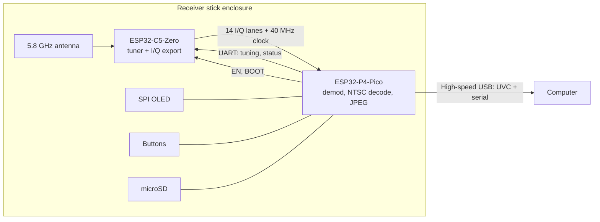

# P4 receiver plan

Plan for a self-contained receiver built from the Waveshare ESP32-C5-Zero and the Waveshare ESP32-P4-Pico. The C5 tunes and exports raw I/Q, and the P4 demodulates, decodes NTSC, and presents the video as a USB webcam (UVC) with a serial control port on the same cable.

This is a separate build from the standalone C5 receiver. The C5-only path, which recovers composite video onto the resistor DAC and never decodes pixels, stays as it is.

Nothing here is built yet. The open questions at the end need answers before some choices are final.

## System overview



## Roles

- The C5 tunes the 5.8 GHz front end and drives its MODEM_DIAG I/Q bits onto pads, with a sample clock. It answers tuning and status commands on a UART. Its DAC and PARLIO loopback are not used in this build.
- The P4 samples the I/Q bus with PARLIO RX, demodulates FM, decodes NTSC fields, encodes JPEG, and serves UVC. It owns all settings (band, channel) and pushes them to the C5 at boot. It runs the OLED, buttons, and optional SD recording.
- The computer receives a webcam stream and a serial port. A browser page (Web Serial) controls the receiver and shows signal strength.

## Power

- The P4-Pico is powered through its high-speed USB connector (the bottom 4-pin MX1.25 JST), which feeds its VCC_5V rail directly. The top USB-C also powers it, through a power-path FET, so both can be plugged in at once.
- The C5 takes 5V and GND from a branch of the JST lead, at the plug end. JST pin 1 is VCC_5V, the same net as the header's VSYS, but VSYS is at the far end of the board and the branch is only a couple of centimeters from the C5's 5V and GND pads. Do not use VBUS, which is the USB-C input before the power-path FET.
- Do not power the C5 from its own USB while it is also fed from the JST lead, unless the C5-Zero schematic shows a diode on its VBUS.
- Budget: roughly 100-150 mA for the C5, 200-400 mA for the P4, and about 20 mA for the OLED. This fits the 500 mA of a USB 2.0 port.

## Board pinouts

Waveshare's diagrams, from the [ESP32-C5-Zero](https://docs.waveshare.com/ESP32-C5-Zero) and [ESP32-P4-Pico](https://docs.waveshare.com/ESP32-P4-Pico) wiki pages:

- [C5-Zero pinout](images/waveshare-c5-zero-pinout.webp) and [dimensions](images/waveshare-c5-zero-size.webp) (18 × 28 mm).
- [P4-Pico pinout](images/waveshare-p4-pico-pinout.webp), [dimensions](images/waveshare-p4-pico-size.webp) (57.3 × 21 mm) and [front and back](images/waveshare-p4-pico-hardware.webp), which shows the back pads.


Physical order, both boards viewed from the component side with the USB-C at the top:

- C5-Zero left edge: 5V, GND, 3V3, 0, 1, 2, 3, 4, 5. Right edge: 11, 12, 13, 14, 10, 9, 8, 7, 6. Back pads 23, 24, 25 and 28 sit in a column about 1.6 mm apart, inboard of the left edge, level with rows 4-6. The U.FL and antenna are at the bottom.
- P4-Pico left header (rows 1-20): 54, 19, GND, 18, 17, 16, 15, GND, 14, 6, 5, 4, GND, 3, 2, 8, 7, GND, 24, 25. Right header: VBUS, VSYS, GND, EN, 3V3, 20, 21, GND, 22, 23, RUN, 26, GND, 27, 32, 33, 46, GND, 47, 48. The JST is at the bottom, below row 20.
- P4-Pico back pads, seen from the front: 28, 29, 30, 31, 34 run down the right side and 36, 49, 50, 51, 52 down the left, about 1.6 mm apart, in the last 8 mm before the JST end. 34 and 36 are strapping pins.

## Layout

The boards sit in line: antenna at the front, then the C5 with its USB-C end facing back, then the P4 with its JST end facing the C5, and the P4's USB-C at the rear. The gap between the boards is about 8 mm, enough for the JST plug and its lead to turn back under the P4.

With the C5 turned to face the P4, its left edge (5V, GND, 0-5 and the back pads) lines up with the P4's right header, and its right edge (11-14, 6-10) lines up with the P4's left header. Every wire stays on its own side, and the fast signals use the P4 pins within about 8 mm of the JST end.

## C5-Zero pin plan

The C5 can route any MODEM_DIAG lane to any pad, and the P4 can read any lane from any GPIO, so the lane order doesn't matter when soldering. A walking-ones pattern from the C5 lets firmware discover the order (see [Firmware](#firmware)).

| Function | C5 pins | Notes |
|---|---|---|
| 5V, GND | 5V, GND (left, rows 1-2) | From the JST lead branch |
| UART to P4 | 11 (TX), 12 (RX) | UART0, so the ROM bootloader can be reached and the P4 can reflash the C5. TX has a 499 Ω series resistor on the board |
| BOOT | 28 (back pad) | Driven by the P4, open-drain. The board's BOOT button is unreliable, so this is also the manual fallback: ground 28 while resetting |
| Reset | EN, via the RESET button pad | Driven by the P4, open-drain. EN (CHIP_PU) is not on the edge pads; it has a 10k pull-up and 1 µF to GND, so reset release is slow |
| Sample clock out | 0 | Two rows from the GND pad |
| Q data (7 lanes) | 1, 2, 3, 4, 23, 24, 25 | Left side. The top 7 of Q's 8 live bits |
| I data (7 lanes) | 6, 7, 8, 9, 10, 13, 14 | Right side. The top 7 of I's 8 live bits |
| Spare | 5 | Farthest pad from the P4 |
| Antenna select | 26 | Internal to the board |

From the [C5-Zero schematic](https://github.com/waveshareteam/ESP32-C5-Zero/tree/main/hardware/schematics): GPIO 0 and 1 are the C5's 32 kHz crystal pins, but no crystal is fitted, so they are plain GPIOs. GPIO 13 and 14 pass through 22 Ω series resistors and also reach the USB-C connector, a short stub that shouldn't matter at 40 MHz. The back pads 23, 24, 25 and 28 are test points rather than through-holes, so tack the wires on and anchor them. GPIO 28 has a 10k pull-up to 3.3 V.

GPIO 2, 7 and 25 are strapping pins. They are safe as data outputs because the P4 inputs are high-impedance while the C5 reads its straps at reset.

GPIO 13 and 14 are the C5's USB pins. The finished build gives up the C5's USB console and uses them as data pads, so firmware must release them from the USB PHY before driving them. Standalone flashing over the C5's USB still works with BOOT held, because the ROM re-enables USB serial in download mode. Don't plug the C5's USB into anything while it is streaming.

All 8 bits of both I and Q are live (confirmed on another branch), but 8+8 needs 17 pads: 16 lanes plus the clock. That only fits if the C5's USB becomes the control and flashing link to a USB host on the P4, freeing the UART and BOOT pads. 7+7 keeps the simpler UART control and passthrough flashing.

## P4-Pico pin plan

| Function | P4 pins | Notes |
|---|---|---|
| Q data (7) | 28, 29, 30, 31 (back pads), 48, 46, 33 | Right side |
| I data (7) | 49, 50, 51, 52 (back pads), 25, 24, 2 | Left side. 24/25 are the full-speed USB pair, so firmware must release them from the USB PHY, which gives up the P4's USB-Serial-JTAG. Flashing and the console use the CH343 on the USB-C instead, and JTAG debugging over these pins isn't available |
| Sample clock | 47 | Between 48 and the row-18 GND |
| C5 BOOT | 32 | Open-drain |
| UART RX from C5 TX (GPIO11) | 3 | |
| UART TX to C5 RX (GPIO12) | 4 | |
| C5 EN | 5 | Open-drain |
| OLED SPI: SCLK, MOSI, CS, DC, RST | 15, 16, 17, 18, 19 | |
| Buttons | 6, 7, 8, 14 | 7/8 are I2C to the codec with 2.2k pull-ups, which suits active-low buttons |
| Spare | 20, 21, 22, 23, 26, 27, 54 | |

Board facts from the [P4-Pico schematic](https://files.waveshare.com/wiki/ESP32-P4-Pico/ESP32-P4-Pico-datasheet.pdf):

- The top USB-C goes only to a CH343 USB-UART (P4 UART0 on GPIO 37/38, with auto-reset). It is for flashing and the console, not UVC. In this layout it is at the rear, reachable through the enclosure.
- High-speed USB goes only to the bottom MX1.25 connector (V, D-, D+, G).
- The header pin labeled EN is the 3.3 V regulator enable, and RUN resets the P4. Neither is used here.
- The audio codec (I2S on GPIO 9-13), speaker amp (GPIO 53), SD card (GPIO 39-45) and flash are on pins not used by this plan.
- GPIO 34 and 36 are strapping pins; leave them alone.

## Physical build

### Stick layout

- Keep the last 2-3 cm around the antenna free of wires, screws and metal.
- The P4's switching regulator sits at its USB-C end, which is the rear, away from the antenna.
- If the external dipole is used, mount an SMA bulkhead at the tip with a short U.FL pigtail.
- The OLED and buttons can go anywhere along the stick.
- Hold the boards with printed standoffs and clips or double-sided tape, and anchor the wire bundles so flexing doesn't land on solder joints.

### Wire list

Lengths are estimates for the 8 mm gap, including about 6 mm of slack for dressing and strain relief. Cut each to fit; every wire is 4.5 cm or less. Wires to the P4's back pads run under the P4; the C5's castellated edge pads take a wire from either face.

Colors: red is 5V, black is GND, white is the clock, green is Q data, blue is I data, and yellow is control. Lanes within a color don't need telling apart, because firmware maps them. The four yellow wires are distinguishable by position: BOOT is the only yellow on the Q side, and on the I side, EN goes to the button pad while TX and RX go to adjacent header pads. The P4 can swap its UART pins in firmware if TX and RX are crossed.

| Signal | C5 pin | P4 pin | Color | Length |
|---|---|---|---|---|
| Clock | 0 | 47 | White | 3 cm |
| GND (clock return) | GND | GND, right row 18 | Black | 3 cm |
| Q | 1 | 29 (back) | Green | 3.5 cm |
| Q | 2 | 48 | Green | 3.5 cm |
| Q | 3 | 30 (back) | Green | 3.5 cm |
| Q | 4 | 31 (back) | Green | 4 cm |
| Q | 23 (back) | 33 | Green | 4 cm |
| Q | 24 (back) | 46 | Green | 4 cm |
| Q | 25 (back) | 28 (back) | Green | 3.5 cm |
| BOOT | 28 (back) | 32 | Yellow | 4.5 cm |
| I | 6 | 52 (back) | Blue | 4 cm |
| I | 7 | 51 (back) | Blue | 4 cm |
| I | 8 | 25 | Blue | 3.5 cm |
| I | 9 | 50 (back) | Blue | 3.5 cm |
| I | 10 | 49 (back) | Blue | 3.5 cm |
| I | 13 | 2 | Blue | 4 cm |
| I | 14 | 24 | Blue | 3 cm |
| UART C5 TX to P4 RX | 11 | 3 | Yellow | 3.5 cm |
| UART C5 RX from P4 TX | 12 | 4 | Yellow | 4.5 cm |
| EN | RESET button pad | 5 | Yellow | 4.5 cm |
| GND (I-side return) | USB-C shell | GND, left row 18 | Black | 3 cm |
| 5V | 5V | JST lead branch | Red | 2-3 cm |
| GND | GND | JST lead branch | Black | 2-3 cm |

### Wiring practice

- Use 30 AWG (Kynar wire-wrap wire works well) for signals. At these lengths the wires behave as plain wires, and length matching doesn't matter (2 cm is about 0.1 ns against a 25 ns sample period).
- Use 28 AWG, or two 30 AWG in parallel, for 5V and GND.
- The C5-Zero has one GND pad. Its second ground point is the USB-C shell, which the schematic ties to GND; that gives each bundle its own return, with the black wire running alongside the white clock on the Q side. More grounds between the P4's GND pins and the C5's GND pad help if the link test shows errors. A ground connected at one end only carries no return current and does nothing useful.
- Keep each bundle together with its ground alongside. What matters is the loop area between each signal and its return.
- Firmware sets low drive strength on the C5 data and clock pins to slow the edges. If the link still shows errors, add 22-33 Ω series resistors at the C5 end.

### USB and panel connector

- Crimp an MX1.25 4-pin lead for the P4's JST and wire it to a panel-mount USB port at the rear of the enclosure. The lead runs back under the P4, so it is about 8-10 cm long.
- High-speed USB is fine over that length if D+ and D- are twisted together all the way, with 5V and GND alongside. Route it away from the IQ bundles, crossing them at right angles where it passes the gap.
- Branch 5V (red) and GND (black) from the lead at the JST plug to the C5's 5V and GND pads.
- A USB-C receptacle needs 5.1 kΩ from each CC pin to GND, or a USB-C to USB-C cable will not supply power.
- The P4's own USB-C stays reachable at the rear for flashing, so the rear has two ports: video and power, and programming.

## Firmware

### C5

- Route the top 7 live bits of each of Q and I from MODEM_DIAG to the 14 data pads, release GPIO 13 and 14 from USB, and output a 40 MHz sample clock.
- Set low drive strength on the data and clock pads.
- Add a text command set on the USB console first, then the same parser on the UART to the P4: band, channel, frequency, status.
- Status includes the existing `strength` score, wideband RSSI (`phy_get_rssi`), noise floor, and current gain, all already in `C5VRX_LAB_ROW`.
- Drop the bench-only commits (forced R3, U.FL antenna) once tuning is controllable.
- A test mode that drives a counter pattern on the data lanes, for checking the link, and a walking-ones pattern (one lane high at a time) so the P4 can discover which C5 lane lands on which P4 pin.

### P4

- Sample the 14 lanes plus clock with PARLIO RX in 16-bit mode (two lines unused), choosing the clock edge that samples mid-bit.
- Demodulate FM from I/Q. With 7+7 bits, a lookup table is too large, so use a cross-product discriminator on the CPU (SIMD). That leaves roughly 20 cycles per sample per core at 400 MHz, which is tight.
- Decode NTSC fields: adaptive sync threshold, per-line resampling, burst-locked color, three-line comb.
- Encode JPEG with the hardware encoder and serve a composite USB device: UVC plus CDC-ACM serial (TinyUSB, Espressif's `usb_device_uvc`).
- Put per-frame metadata in a JPEG COM segment written after SOI: frame counter, field-sync timestamp (esp_timer µs), C5 signal level, gain changes tagged with IQ sample index, and sync and noise quality. The metadata survives only if the host keeps the compressed MJPEG (libuvc, or ffmpeg with `-c:v copy`); OS webcam APIs that hand over decoded frames drop it. UVC payload headers also carry a device-clock PTS per frame, as a cross-check.
- Offer 720×480 at 60 fps (one frame per field, deinterlaced) and at 30 fps (fields woven). 60 is the default for FPV. 720×480 at 60 fps is about 20 megapixels per second, within the JPEG encoder's limit.
- Drive the OLED (128×64 SSD1306 or SH1106: band, channel, frequency, strength bar) and the buttons (band and channel).
- Control the C5's EN and BOOT pins for reset and reflashing it over UART0 (esp-serial-flasher).
- Optional standalone recording of MJPEG to microSD (roughly 3-4 MB/s).

### Control protocol

Plain text lines over the USB serial port, so they can be typed by hand, parsed in a browser, and logged. Buttons and serial commands go through the same handler, so the OLED and the browser always agree.

```text
> band R
> ch 3            (or: freq 5732)
< ok band=R ch=3 freq=5732
> status
< status band=R ch=3 freq=5732 strength=87 rssi=-48 gain=34 sync=1 fields=59.9
< event status ...          (pushed a few times a second when subscribed)
```

### Browser page

A Web Serial page with band and channel buttons, the current frequency, and a live strength graph. It first talks to the C5's own USB console, then unchanged to the P4 once it relays the same protocol.

## Open questions

- Does the camera capture 60 images per second, or 30 split across fields? Capture a moving scene and compare the two fields of one frame.
- Can the P4 demodulate 7+7-bit I/Q at 40 MS/s with time left for decoding and encoding?
- What is the maximum PARLIO RX external clock on the P4 through the GPIO matrix, and which clock edge gives margin?
- Are C5 GPIO 11/12 the ROM bootloader's UART0 pins?

## Build order

1. C5 command set on its USB console, and the Web Serial page against the C5 directly.
2. When the P4 arrives: power, UART, EN and BOOT, OLED and buttons. Channel control and status work end to end, with no video.
3. C5 clock output and I/Q export. Capture on the P4, check the link with the counter pattern, and compare samples with a host-side decode offline.
4. Demodulation and NTSC decode on the P4, then JPEG and UVC with the serial port alongside.
5. Optional: microSD recording.
