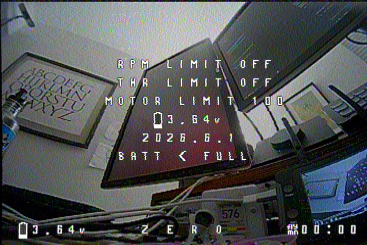
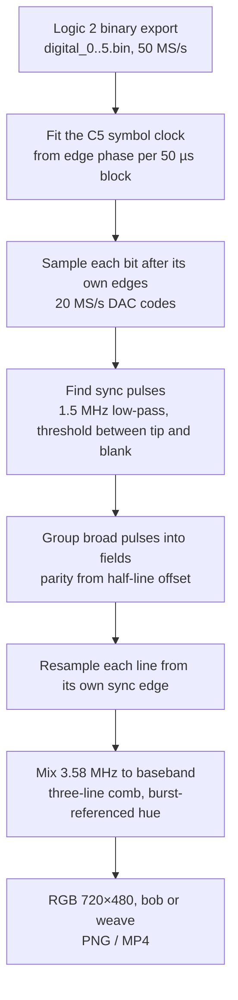
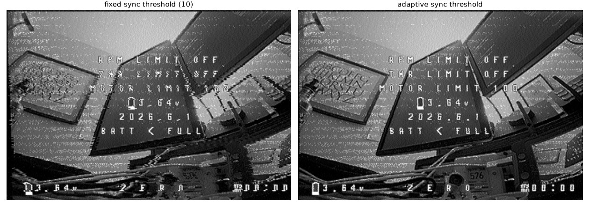
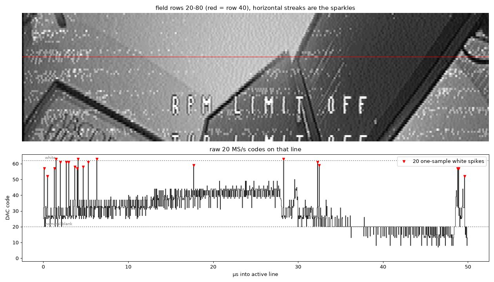
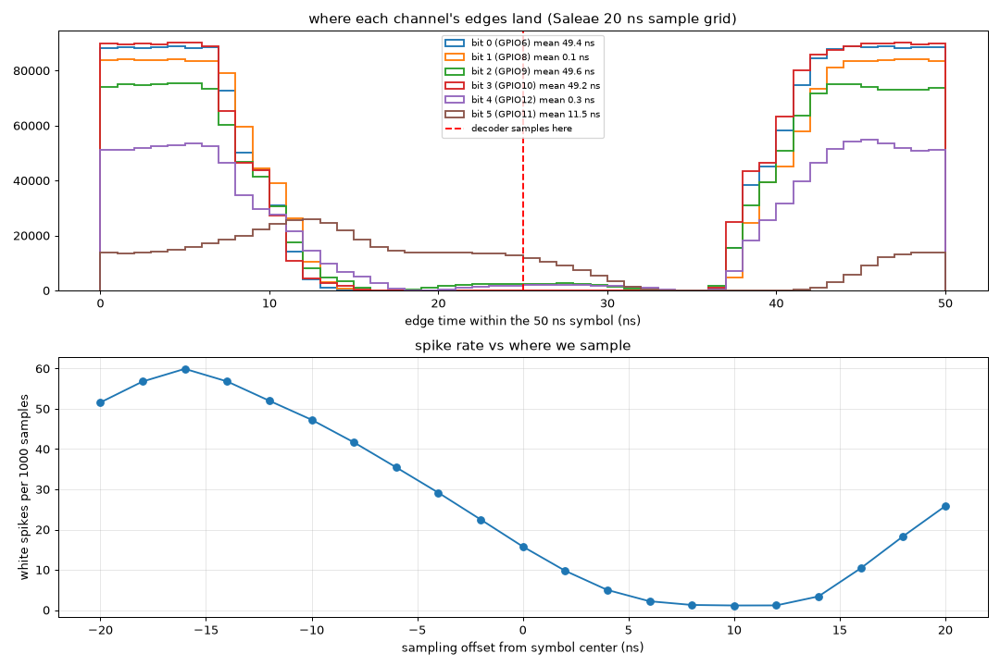
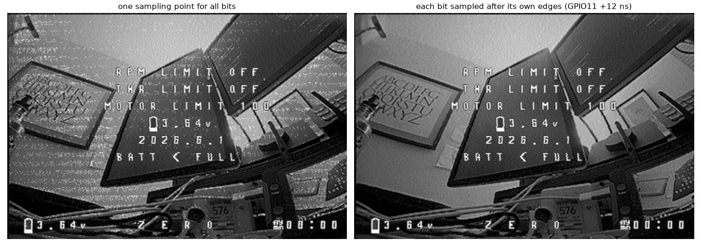
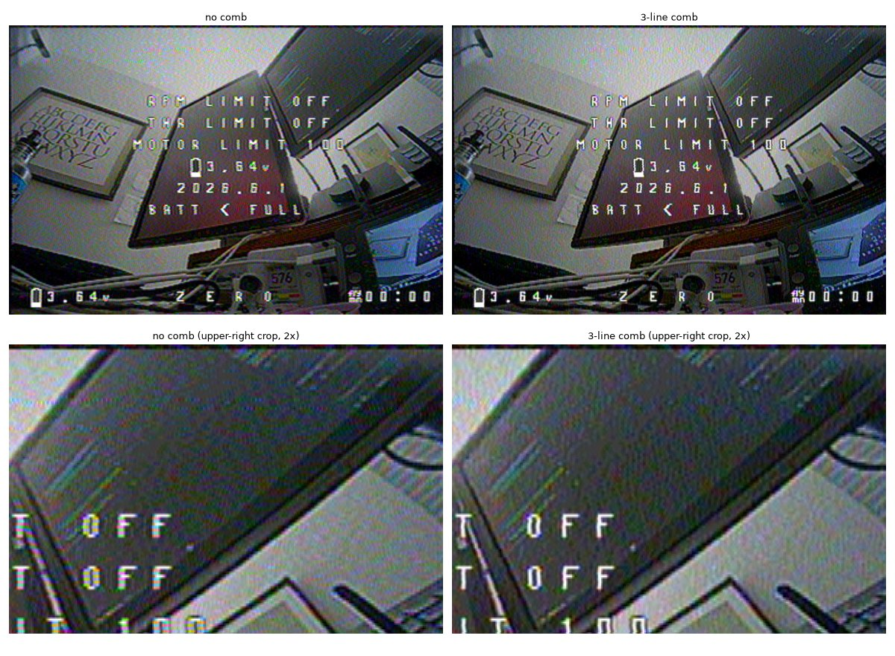

# Decoding C5VRX video from a logic analyzer capture

This branch turns the C5's digital DAC bus into color NTSC video on a computer, without the resistor ladder or goggles. A Saleae Logic 8 records the six DAC pins, and `tools/cvbs/decode.py` recovers the 20 MS/s code stream, finds sync, corrects line timing, decodes color and writes PNG frames or MP4. It was built as a stand-in for a future USB bridge (an ESP32-P4 streaming the same bytes), so everything after code recovery carries over unchanged.

On 2026-09-22 it decoded a live VTX on R3 into a clean color picture.



## Hardware setup

The target is the Waveshare ESP32-C5-Zero, not the XIAO the older docs assume. The RX5808 module used by the RSSI firmware was removed. Nothing is soldered to the ladder for these tests; the analyzer clips directly onto the DAC GPIOs.

| DAC bit | Ladder resistor | GPIO | Logic 8 channel |
|---|---|---|---|
| 0 (LSB) | 8.2k | 6 | 0 |
| 1 | 3.9k | 8 | 1 |
| 2 | 2.0k | 9 | 2 |
| 3 | 1.0k | 10 | 3 |
| 4 | 470 | 12 | 4 |
| 5 (MSB) | 240 | 11 | 5 |

The bits ascend the right edge of the board and skip GPIO 7, which is a strapping pin. The experimental 4BIT@80 output mode drives the top four of them (9, 10, 12, 11). The I/Q loopback pads are GPIO 1, 0, 25, 23, 24, 5, 3, 4, the same as the RSSI firmware; nothing may be wired to them. GPIO 2 and 7 are left free because they are strapping pins, and GPIO 13/14 stay USB. The bit-to-resistor order is unchanged from the tested XIAO layout; only the GPIO numbers moved.

GPIO26 selects the antenna (low is on-board, high is U.FL). The bench firmware currently selects U.FL.

## Branch layout and building

The branch sits on upstream `main` at `96446ed` (PR #62) plus a copy of the fork's "ignore discord" commit, so jj never snapshots `discord/`. Commits, oldest first:

- Target the Waveshare C5-Zero: 4 MB flash, antenna switch on GPIO26.
- Move the DAC to the right edge and the loopback pads to the back pads; `video.c` reads the loopback pins from `rf_iq_pins` in `rf.c`.
- Recover DAC codes from a Saleae capture; decode grayscale fields; document the Logic 8 rate ceiling; point the channel map at the new pins.
- Rake tasks to build in Docker and flash over USB.
- Start on R3 regardless of the saved channel (bench only).
- Start the second field on line 284.
- Receive on the U.FL antenna (bench only).
- Set the sync threshold from measured levels.
- Sample each DAC bit after its own edges.
- Decode NTSC color, then separate chroma with a three-line comb.

The RSSI firmware line and the `docs/how-it-works` bookmark are untouched and still branch from the older fork base.

Build and flash with the Rakefile:

```bash
rake build
```

```bash
rake flash
```

`rake build` runs `idf.py` in `espressif/idf:v6.0.2` and builds into `build-<project>/` with its own `sdkconfig`, so the video and RSSI firmware never share a stale config. `rake flash` builds, then runs Homebrew `esptool` with `write-flash @flash_args` from that directory. It picks the single `/dev/cu.usbmodem*` port or takes `PORT=`.

## Capturing and decoding

Capture channels 0-5 at 50 MS/s, export raw binary, and decode:

```bash
python tools/cvbs/decode.py ~/capture-dir --codes capture.u8 --png frames --mp4 capture.mp4
```

Useful flags: `--weave` pairs fields into 30 fps frames instead of line-doubling each field at 60 fps; `--gray` skips color; `--no-comb` separates chroma within each line only; `--saturation` scales color. Passing a saved `.u8` code file instead of an export directory skips clock recovery. Install `tools/cvbs/requirements.txt` first. The tests run with `pytest tools/cvbs`.

The logic2 MCP server can drive the whole capture: `start_capture` with digital channels 0-5 at 50 MS/s in timed mode, `wait_capture`, then `export_raw_data_binary`.



## Findings

### The Logic 8 is fast enough, barely

With six digital channels enabled, Logic 2 allows at most 50 MS/s on a Logic 8, and the Logic 8 has no configurable threshold. That is 2.5 analyzer samples per 50 ns DAC symbol, which is enough because every code is held for a full symbol. Exports are format version 0: a 44-byte header followed by float64 transition times, one `digital_N.bin` per channel.

The decoder needs no clock wire. Edges only occur on the C5's 50 ns grid, so the phase of the edges against a nominal 20 MHz, measured in 50 µs blocks, drifts linearly with the clock offset between the two boards. On live captures the C5 ran +17 to +19 ppm relative to the analyzer with about 1 ns RMS residual.

### An untuned C5 produces a recognizable noise signature

The first capture held only codes 0, 20 and 63, with bits 0, 1, 3, 5 identical on every sample and bits 2, 4 identical. Those are the demodulator LUT's outputs for large random phase jumps (squelch to blank, clip to sync, clip to white). There was no energy at the 15.7 kHz line rate. The C5 had booted on its default channel rather than the VTX's R3; forcing R3 at boot fixed it.

### Flashing and serial quirks

Holding BOOT latches download mode across later USB-triggered resets, so after a manual flash the board keeps booting into `waiting for download` until a real RESET or power cycle. `esptool`'s automatic reset into the bootloader failed every time while the video firmware was running ("No serial data received"), so flashing currently needs BOOT held while tapping RESET. Opening the port with pyserial's default line states (DTR and RTS both asserted) does not reset the running firmware, and the `p` console command then prints a telemetry snapshot.

### Blanking sits below the demodulator's zero

Blanking arrived near code 11 instead of the LUT's pedestal of 20, with sync tips near 1.5. That is about 1.5 phase bins, roughly 0.9 MHz, most likely a tuning offset between the VTX and the C5. The old fixed sync threshold of 10 sat just under blanking, so the color burst right after each sync dipped across it and split most pulses: about 90 of 240 line syncs per field went undetected. Detection now low-passes at 1.5 MHz, which removes the burst, and thresholds halfway between the measured sync tip and blanking. Missed syncs fell to 0.5 per field on one capture and 3.8 on the other.



### Field 2 starts on line 284

Line 283 is a half line, so the second field's first full picture line is 284, the same 17 lines after the first broad pulse as line 21 in field 1. Weaving a live capture with 283 put field 2 one line too high; scoring each field-2 line against the average of its field-1 neighbors confirmed the corrected offset.

### The sparkles were the analyzer catching GPIO11 mid-edge

After sync was fixed, the picture still had bright horizontal streaks. The C5's own telemetry showed a clean receiver: locked on R3, signal power 18 against a 20-30 target, no ADC clipping, no samples near the origin, 99-100% phase coherence and no phase slips. The streaks were single-sample jumps from mid-gray (code 32) to 52-63, clustered where the code crosses 31/32 and the MSB flips along with several lower bits.



Histogramming each channel's edges within the symbol showed the cause. Five bits switch within about 10 ns of the symbol boundary; bit 5 on GPIO11 lags by about 12 ns on average and smears across roughly 35 ns. Sampling every bit at the shared symbol center caught it mid-transition. The spike rate falls to a floor when sampling moves 8-12 ns later.



Each bit is now sampled after its own mean edge lag (measured offsets: -1, 0, 0, -1, 0, +12 ns). One-sample white spikes fell from 13.0 to 1.9 per 1000 samples on one capture and from 15.8 to 3.7 on the other.



This matters beyond the analyzer: on the real ladder, GPIO11 drives the 240 Ω MSB, so each 31/32 crossing would put a glitch of about 12 ns on the analog output. The 470 pF filter should absorb most of it. Setting the DAC pins to maximum drive strength, already proposed in [How it works](how-it-works.md), may shorten it. Whether something on the Waveshare board loads GPIO11 is unchecked.

### The external antenna made no measurable difference

With the VTX inches away, the U.FL dipole and the on-board antenna decoded equally well once the decoder was fixed. Weak signal was never the problem.

### Color decodes from the burst

The color burst on live captures measured about 7.6 codes of amplitude against 8.4 expected for 20 IRE, and its phase varied only about ±5° from line to line. The decoder mixes the whole stream to baseband with a free-running 3.579545 MHz oscillator, so the continuous subcarrier has nearly the same phase on every line in that frame. Each line's burst (averaged over five lines) rotates chroma onto the standard -U reference and scales it to 20 IRE, which makes saturation independent of that offset.

Luma detail near 3.58 MHz flips sign every line in that frame, because a line is 227.5 subcarrier cycles long, while real chroma does not. A three-line (1, 2, 1) comb therefore cancels cross-color, and luma subtracts only the combed chroma, so it keeps its detail. On synthetic stripes at 3.4 MHz with no color, false color fell from 49.9 to 0.6; on the live capture the yellow and cyan fringes around the on-screen text disappeared.



The remaining blotchy color noise in flat areas comes from the demodulator: the burst's ±20 IRE swing spans only about ±1.3 of its 11.25° phase bins.

## Architecture notes

These answer the questions that started the work.

- A USB video device needs a second chip. The C5 has only USB Serial/JTAG at full speed. The ESP32-P4 has high-speed USB, a hardware JPEG and H.264 encoder, and 16-line PARLIO RX, so it can capture this same six-bit bus and either stream it or transcode it to MJPEG.
- The C5 cannot capture 8+8 bit I/Q itself: `SOC_PARLIO_RX_UNIT_MAX_DATA_WIDTH` is 8 on the C5 and it has no other parallel input. The DIAG bus probably carries the low bits (signals 0-19 all toggle with the VTX off, matching the 10+10 bit dump format), but only DIAG 6-9 and 16-19 are hardware-verified. A P4 could capture 16 routed lines.
- Diversity works best as per-sample post-detection combining weighted by |IQ|², with both C5s on one shared 48 MHz reference so their samples stay aligned. The demodulator's spare LUT output bits could carry a confidence value.
- Deinterlacing is straightforward once fields are decoded: bob with edge-directed interpolation, or motion-adaptive using only the previous field, adds no latency.

| Stream | Rate | Fits USB 2.0 high speed |
|---|---|---|
| Raw Q4/I4 at 40 MS/s | 40 MB/s | At the limit |
| Raw Q8/I8 at 40 MS/s | 80 MB/s | No |
| Demodulated codes at 20 MS/s | 20 MB/s | Yes |
| Deinterlaced MJPEG, 720×480 | 2-8 MB/s | Yes |

The Logic 8 cannot capture raw I/Q either: eight channels at the 80 MS/s DIAG rate is far past its limits.

## Open items

- The R3 and U.FL commits are bench settings; drop or replace them with console or menu control.
- The automatic USB reset into the bootloader fails while the video firmware runs.
- Blanking sits about 0.9 MHz below the demodulator's zero; AFC or a manual frequency offset would test whether it is a tuning offset and recenter the levels.
- An adaptive comb would avoid vertical color smearing on sharp horizontal color edges.
- The pin tables in [How it works](how-it-works.md) and the README still describe the XIAO.
- iCloud-style duplicates (`name 2.ext`) appeared in the working copy once; check for them before committing.
- Next hardware steps: the P4 bridge, then 16-line I/Q capture on the P4.
